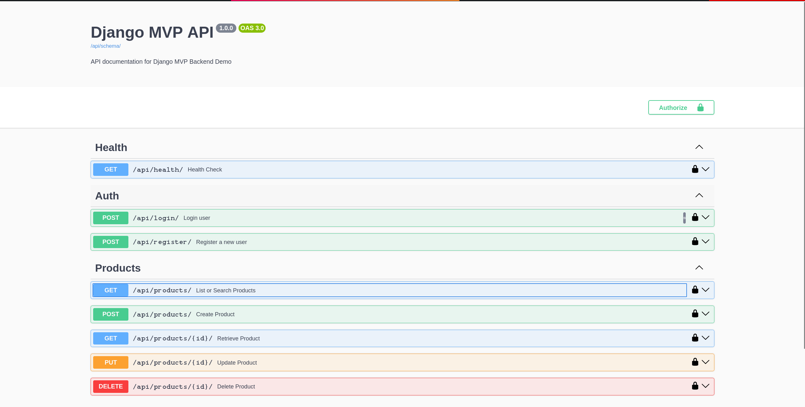

# Django MVP Backend Demo

🚀 Live Demo: [link](http://ec2-51-21-152-186.eu-north-1.compute.amazonaws.com/)


📄 API Docs: [link](http://ec2-51-21-152-186.eu-north-1.compute.amazonaws.com/api/docs/)

A minimal Django project structure with Docker, DRF, and Postgres.

## Requirements

- Docker
- Docker Compose

## Setup

1. Copy `.env.example` to `.env`:
   ```bash
   cp .env.example .env
   ```

2. Build and start the containers:
   ```bash
   docker-compose up --build
   ```

   The server will be available at `http://localhost:8000`.

## Features

- **Django**: 5.x
- **DRF**: Django Rest Framework
- **Postgres**: Database
- **Docker**: Containerization with layer caching optimization
- **Swagger/Redoc**: API Documentation
- **Auth**: JWT Authentication (Access/Refresh Tokens)
- **Products**: Product management with Search & Pagination
- **Monitoring**: Healthcheck endpoint

## Structure

- `app/`: Settings, WSGI, main URLs
- `core/`: Application logic
    - `models.py`: Product model
    - `views.py`: Product APIViews (Pagination, Search) & Healthcheck
    - `auth_views.py`: Register/Login views (JWT)
- `scripts/`: Helper scripts (entrypoint, seed)
- `docs/`: Example API usage

## Live Demo (Optional)
This project can be deployed on a single AWS EC2 instance using Docker.
See [deploy/README.md](deploy/README.md) for a quick setup.

## screanshots




## Usage

### Run Seed Data
To populate the database with sample data:
```bash
docker-compose exec web python scripts/seed.py
```

### Access API
- **Swagger UI**: `http://localhost:8000/api/docs/`
- **Redoc**: `http://localhost:8000/api/redoc/`

### Key Endpoints
- `POST /api/register/`: Register a new user
- `POST /api/login/`: Login to get JWT tokens
- `GET /api/products/`: List products (Search + Pagination)
- `GET /api/health/`: System health check

